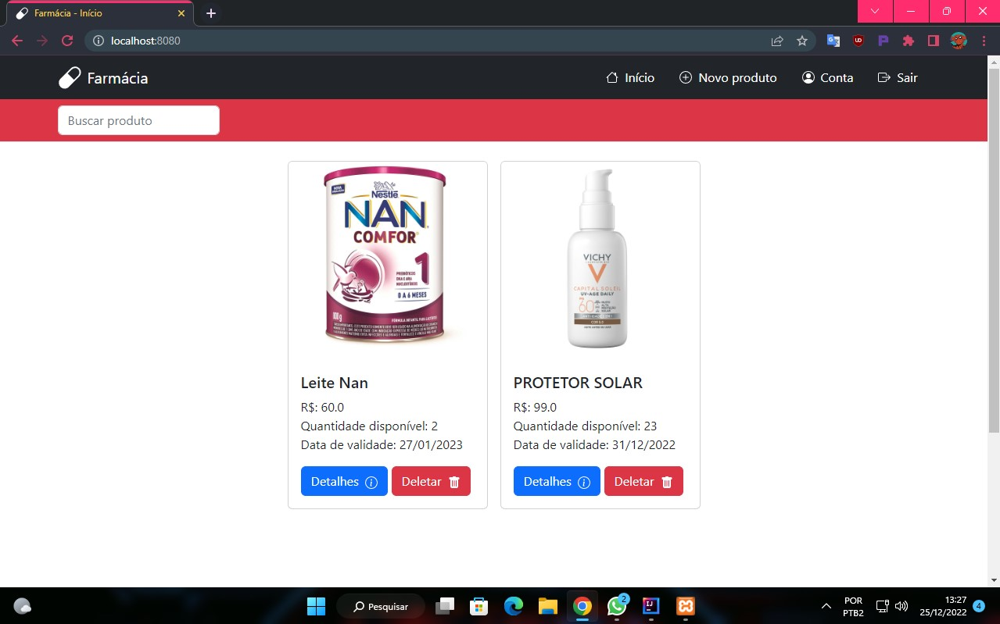
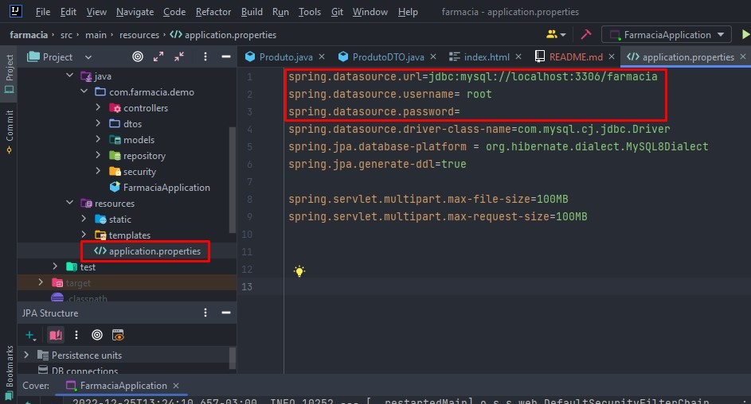

# Gerenciador de estoque de farmácia com Spring Boot

Site desenvolvido com Java Spring Boot para gerenciamento de estoque de farmácia.
Neste site possível cadastrar uma farmácia, fazer login com os dados da farmácia e cadastrar seu produtos.

## Execução

Para poder executar a aplicação, é preciso passar as informações do banco de dados MySql no arquivo application.properties,
como é mostrado na imagem a seguir.

Depois que as informações do banco de dados estiverem corretas basta executar o FarmaciaApplication.